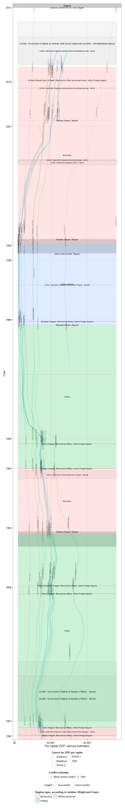
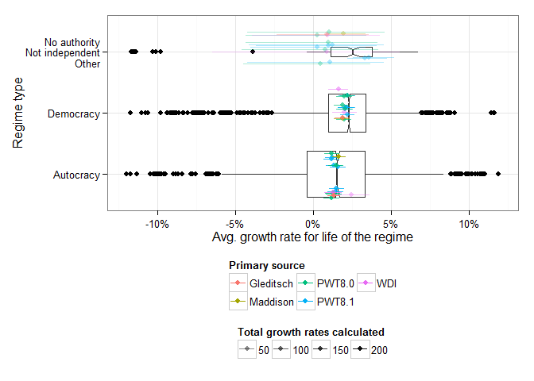
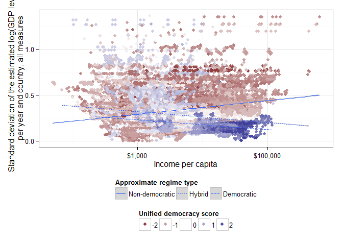

# The Mismeasure of Growth

About six months ago, [Tom Pepinsky](https://twitter.com/TomPepinsky) wrote [a post](http://tompepinsky.com/2015/03/23/singapore-from-third-world-to-first/), on the occasion of Lee Kuan Yew's death, where he argued graphically that Lee Kuan Yew's claim to have taken Singapore "from Third World to First" was a bit overstated. (Yes, I'm posting about this six months later - but I have never claimed that this blog offers hot takes on the news!). Using Kristian Gledistch's [expanded GDP data](http://privatewww.essex.ac.uk/~ksg/exptradegdp.html), he noted that,in percentile terms, Singapore was already quite wealthy by the time it became independent, especially compared to its neighbours:

 

By this measure, Singapore was as wealthy as the UK (per capita) by the mid-1970s, not because it had grown especially fast, but because it had started from a relatively high base. On this view, the most we could say is that Singapore escaped the "middle income trap," not so much the "third world." 

As I recall, however, at the time there was a bit of pushback on Twitter and in the comments to the post about both the data source used (Gleditsch rather than the Penn World Table or the Maddison data) and the decision to look at the percentile rank of income rather than the actual per capita income. Indeed, the figure above looks very different if we use the [Penn World Table](http://www.rug.nl/research/ggdc/data/pwt/pwt-8.1)'s latest measure of "expenditure side real GDP, at chained PPPs" (recommended by the Penn World Table investigators for "comparison of living standards across countries and over time"):

 

(There's no data for Myanmar in the PWT 8.1).

Now Singapore's starting income rank is much closer to Malaysia's (they were, after all, part of the same country until 1965), solidly in the middle, and does not reach the UK's income rank until the 1990s, instead of the 1970s. The difference between the two graphs is even starker if, instead of percentile ranks, we simply look at the actual income per capita numbers in PWT8.1 vs the Gleditsch data:

 

Using the recommended PWT 8.1 measure, Singapore at independence in 1965 had a per capita income of around $3,000 per capita, only a bit higher than Malaysia's, and only one-sixth of US income; using the Gleditsch data, by contrast, Singapore starts out at nearly double the income level of Malaysia (more than $6000 compared with around $3,500), about a third of US income (and about half of UK income). It's a big head-start, and it does make Lee's achievement look a bit less impressive (an average growth rate for the period 1965-1990, when Lee was Prime Minister, of 4.8% rather than 6.9% per year for the PWT8.1 measure). At the time, I thought that the difference between the two estimates of Singaporean GDP was simply a matter of different data sources. But when you dig deeper, it turns out that the source of Gleditsch's numbers for Singapore was ... the Penn World Table (version 8.0)! 

What is going on here? In this particular case, the discrepancy is due, first, to [adjustments in the 2005 PPPs used between versions 8.0 and 8.1 of the PWT](http://www.rug.nl/research/ggdc/data/pwt/v81/what_is_new_in_pwt_81.pdf) that increased the base price level in many countries and years, and hence lowered their measured GDP, and second, to the fact that the Gleditsch data reports, not the "expenditure side" measure of GDP (basically real GDP adjusted for changes in the terms of trade), but the measure for "output side real GDP at chained PPPs" (which is not adjusted for terms of trade). The latter measure, according to [the PWT's handy guide](http://www.rug.nl/research/ggdc/data/pwt/pwt-8.1), is the one that should be used "to compare relative productive capacity across countries and over time," rather than living standards (which may be affected by favourable terms of trade - e.g., unusually low import prices or unusually high export prices).[^Expenditure] The combined effect of these two differences makes Singapore's economic performance look less impressive on the Gleditsch measure (PWT 8.0) than on the PWT8.1's "expenditure side" measure (or even the PWT8.1's "output side" measure):

 

Indeed, the estimated growth rates for the period of Lee's premiership of independent Singapore (1965-1990),[^Estimates] according to all the different datasets available (Penn World Table 8.0, Penn World Table 8.1, [World Development Indicators](http://data.worldbank.org/data-catalog/world-development-indicators), Gleditsch, [Maddison](http://www.ggdc.net/maddison/maddison-project/)) do vary a fair amount:

 

(I include a measure from PWT8.1 for "real consumption of households and government, current PPPs," which is also used to compare growth in living standards, [according to this PWT document](http://www.rug.nl/research/ggdc/data/pwt/v81/what_is_new_in_pwt_81.pdf). Error bars can be understood as a measure of volatility - larger error bars indicate more ups and downs in performance). To be sure, by whatever measure, Singapore under Lee Kuan Yew grew very fast compared to the rest of the world (certainly in the top 10% of all countries for the period 1965-1990, sometimes appearing as the top performer overall); but purely by accident, the Gleditsch data shows Lee in the worst possible light: 

<table border=1 cellpadding='10' cellspacing = 3>
<tr> <th> variable </th> <th> estimate </th> <th> percentile </th> <th> rank </th>  </tr>
  <tr> <td> PWT 8.1: Output side, chained PPPs </td> <td> 7.25% </td> <td align="right"> 100 </td> <td> 1 out of 57 </td> </tr>
  <tr> <td> PWT 8.1: Output side, current PPPs, 2005$ </td> <td> 7.21% </td> <td align="right"> 100 </td> <td> 1 out of 57 </td> </tr>
  <tr> <td> PWT 8.1: Expenditure side, current PPPs, 2005$ </td> <td> 7.03% </td> <td align="right"> 100 </td> <td> 1 out of 57 </td> </tr>
  <tr> <td> PWT 8.1: Expenditure side, chained PPPs </td> <td> 6.89% </td> <td align="right"> 100 </td> <td> 1 out of 57 </td> </tr>
  <tr> <td> WDI: GDP per capita, constant 2005$ </td> <td> 6.63% </td> <td align="right"> 100 </td> <td> 1 out of 42 </td> </tr>
  <tr> <td> Maddison 2013: Real GDP per capita, 1990 Geary-Khamis </td> <td> 6.38% </td> <td align="right"> 99 </td> <td> 2 out of 80 </td> </tr>
  <tr> <td> PWT 8.0: Expenditure side, current PPPs, 2005$ </td> <td> 7.01% </td> <td align="right"> 98 </td> <td> 2 out of 57 </td> </tr>
  <tr> <td> PWT 8.0: Expenditure side, chained PPPs </td> <td> 6.88% </td> <td align="right"> 98 </td> <td> 2 out of 57 </td> </tr>
  <tr> <td> PWT 8.0: Output side, current PPPs, 2005$ </td> <td> 6.86% </td> <td align="right"> 98 </td> <td> 2 out of 57 </td> </tr>
  <tr> <td> PWT 8.1: National-accounts growth rates, 2005$ </td> <td> 6.65% </td> <td align="right"> 98 </td> <td> 2 out of 57 </td> </tr>
  <tr> <td> PWT 8.0: National-accounts growth rates, 2005$ </td> <td> 6.65% </td> <td align="right"> 98 </td> <td> 2 out of 57 </td> </tr>
  <tr> <td> PWT 8.1: Real consumption of households and
government, current PPPs, 2005$ </td> <td> 5.00% </td> <td align="right"> 93 </td> <td> 5 out of 57 </td> </tr>
  <tr> <td> PWT 8.0: Output side, chained PPPs </td> <td> 4.83% </td> <td align="right"> 91 </td> <td> 6 out of 57 </td> </tr>
  <tr> <td> Gleditsch </td> <td> 4.83% </td> <td align="right"> 91 </td> <td> 8 out of 83 </td> </tr>
   </table>

There are perfectly good reasons for this variation in estimates. Current PPP measures of GDP per capita should not, in general, be identical to chained PPP measures, since the PPP conversion factors will vary over time in the latter and not in the former; I assume that this divergence may be magnified when an economy is undergoing genuine structural transformation. Expenditure-side and output-side measures will also vary depending on whether a country is facing better or worse terms of trade, something that will apply especially to trade-dependent economies like Singapore's. 

More generally, the Maddison project, the World Bank, and the Penn World Table project make different adjustments to the numbers produced by national statistical offices, based on different views about how to compare various prices across countries and different assumptions about the structure of particular economies. And though in the Singaporean case this is not really a problem, ultimately most estimates of the productive capacity of an economy, or the living standards of a country, depend on the reliability of national statistical agencies, whose capacity can vary greatly, and are subject to different constraints, including political manipulation. [Morten Jerven](http://mortenjerven.com/), for example, [argues that in some African countries, the numbers measuring GDP are basically guesstimates of limited value](http://afraf.oxfordjournals.org/content/109/434/77.abstract); Jerome Wallace [has written on the political incentives for manipulating GDP statistics in China](http://papers.ssrn.com/sol3/papers.cfm?abstract_id=1975160), especially at the subnational level. (The Chinese case is especially interesting. Though the main PWT data reports estimates of the Chinese economy based on official national accounts data, the PWT researchers also provide an [additional table](http://www.rug.nl/research/ggdc/data/pwt/v81/na_data.xlsx) reporting "adjusted" national accounts data based on the research of [Harry Wu](https://ideas.repec.org/a/wej/wldecn/330.html). The Maddison project reports the Wu-adjusted data instead, which provides generally lower estimates of Chinese economic performance than the official data). 

How much does it matter, however, which measure we use to evaluate the economic performance of particular regimes and political leaders? Which leaders and regimes have the most "disputed" economic performance, depending on the measure used? Using the [Beta version](http://abandonedfootnotes.blogspot.com/2015/01/political-instability-at-glance.html) of the [Archigos](http://www.rochester.edu/college/faculty/hgoemans/data.htm) dataset, I estimated the growth rates of all available measures of GDP per capita for all political leaders who were in office by at least 8 years up until 2014 in the post-1945 period. Eight years may not seem long, but in fact [only about 15% of all leaders](http://abandonedfootnotes.blogspot.com/2012/02/half-life-of-leaders-and-half-life-of.html) survive that long in power, so this is a pretty select group of "political survivors." Moreover, eight years is two American presidential terms (so the data includes some American leaders), and seems long enough for leaders to actually make a difference, or at least successfully ride out a crisis or two. Among this select group of about 350 politically over-achieving group of leaders (some drop out for various reasons, including lack of sufficient economic data), here is the *creme de la creme*, the economic "stars" who presided over growth rates greater than 90% of all other countries with data for the period in which they were in office (averaging all growth rate estimates from the different datasets):

 

The variation at the top is enormous, depending on what measure we use. For example, Obasanjo is ranked as the top performing leader from 1999-2007 on many of the PWT8.1 measures, but only in the 84th percentile according to Maddison, and the estimated growth rates for the period range all the way from 6.7% per year (Maddison) to 28% per year (PWT 8.1, growth in consumption). If we believe the PWT, Obasanjo presided over a seven-fold increase in Nigeria's living standards; if we believe Maddison (or the WDI), Nigerian living standards merely increased by about 1.7 times during his time in office. The economic performance of other leaders varies even more dramatically: if we believe version 8.1 of the PWT, the real consumtion of households and government in Equatorial Guinea under [Teodoro Obiang Nguema Mbasogo](https://en.wikipedia.org/wiki/Teodoro_Obiang_Nguema_Mbasogo) increased about 6 times from 1979-2014; if we believe the GDP per capita measures on the expenditure side in both versions of the PWT, living standards increased about 45 times; and if we believe the output-side measure from the PWT version 8.0, the productive capacity of the economy of Equatorial Guinea increased about 125 times, more than under any other leader in this dataset. A real benefactor! (Right). By contrast, almost all measures agree that Singapore's productive capacity and economic output increased by around fivefold during Lee's time in office (a bit more, a bit less depending on the particular measure used). Lee is unusual among top performers insofar as there is in fact reasonable agreement across different measures regarding the magnitude of his economic achievement.  

The same variability is also evident among the very worst performers:

 

Depending on which measure you use, Nigeria's economic living standards under the military government of Babangida (before Obasanjo) either contracted at a rate of around 17% per year (PWT8.1, expenditure-side measures), or merely remained stagnant (Maddison, World Development indicators). Jabir as-Sabah of Kuwait presided over one of the most severe depressions in modern history (-15% per year for 12 years, output-side measure in PWT 8.0) or merely over an extended recession caused by falling oil prices (-1.3% per year, real consumption measure from PWT 8.1). In the case of Mali under Keita, or Niger under Mamadou, the different datasets do not even agree as to whether the economy was growing or shrinking during their time in power, though most measures point to decline. 

No one particular dataset always gives lower or higher growth estimates. They seem to disagree the most for leaders that presided over states whose statistical capacity is at best dubious, or who were undergoing some severe trade shock (wild swings in the price of oil, or severe conflict or civil war), but it's hard to tell without more detailed analysis. (Estimates of growth rates typically agree across measures in the "advanced" economies). Here, for example, are the leaders whose growth estimates diverge the most when measured in more than two different ways, as well as the sources of the high and low estimates:

<table border=1 cellpadding='10' cellspacing = 3>
<tr> <th> Leader </th> <th>  Lowest  </th> <th>  Highest  </th> <th>  Difference  </th> <th>  Source low  </th> <th>  Source high  </th> <th>  Measures  </th>  </tr>
  <tr> <td> Obasanjo, Nigeria, 1999-2007 </td> <td> 6.8% </td> <td> 28.2% </td> <td align="right"> 21.43 </td> <td> Maddison 2013: Real GDP per capita, 1990 Geary-Khamis </td> <td> PWT 8.1: Real consumption of households and
government, current PPPs, 2005$ </td> <td align="right"> 15 </td> </tr>
  <tr> <td> Babangida, Nigeria, 1985-1993 </td> <td> -18.0% </td> <td> 0.9% </td> <td align="right"> 18.84 </td> <td> PWT 8.1: Real consumption of households and
government, current PPPs, 2005$ </td> <td> Maddison 2013: Real GDP per capita, 1990 Geary-Khamis </td> <td align="right"> 14 </td> </tr>
  <tr> <td> Emile Lahoud, Lebanon, 1998-2007 </td> <td> 0.0% </td> <td> 14.5% </td> <td align="right"> 14.45 </td> <td> WDI: GDP per capita, constant 2005$ </td> <td> PWT 8.1: Output side, chained PPPs </td> <td align="right"> 15 </td> </tr>
  <tr> <td> Jabir As-Sabah, Kuwait, 1978-1990 </td> <td> -14.6% </td> <td> -1.3% </td> <td align="right"> 13.28 </td> <td> PWT 8.0: Output side, chained PPPs </td> <td> PWT 8.1: Real consumption of households and
government, current PPPs, 2005$ </td> <td align="right"> 13 </td> </tr>
  <tr> <td> Amad Al Thani, Qatar, 1995-2007 </td> <td> 2.8% </td> <td> 15.8% </td> <td align="right"> 12.96 </td> <td> Maddison 2013: Real GDP per capita, 1990 Geary-Khamis </td> <td> PWT 8.1: Expenditure side, current PPPs, 2005$ </td> <td align="right"> 13 </td> </tr>
  <tr> <td> Bashar al-Assad, Syria, 2000-2011 </td> <td> 1.4% </td> <td> 13.3% </td> <td align="right"> 11.87 </td> <td> Maddison 2013: Real GDP per capita, 1990 Geary-Khamis </td> <td> PWT 8.1: Real consumption of households and
government, current PPPs, 2005$ </td> <td align="right"> 13 </td> </tr>
  <tr> <td> Bagabandi, Mongolia, 1997-2005 </td> <td> -0.6% </td> <td> 9.9% </td> <td align="right"> 10.49 </td> <td> Maddison 2013: Real GDP per capita, 1990 Geary-Khamis </td> <td> PWT 8.1: Expenditure side, current PPPs, 2005$ </td> <td align="right"> 15 </td> </tr>
  <tr> <td> Hun Sen, Cambodia (Kampuchea), 1985-1993 </td> <td> -4.3% </td> <td> 5.4% </td> <td align="right"> 9.67 </td> <td> Gleditsch, from Maddison, PWT8.0 </td> <td> PWT 8.0: Output side, current PPPs, 2005$ </td> <td align="right"> 13 </td> </tr>
  <tr> <td> Nguema Mbasogo, Equatorial Guinea, 1979-2014 </td> <td> 5.3% </td> <td> 14.8% </td> <td align="right"> 9.52 </td> <td> PWT 8.1: Real consumption of households and
government, current PPPs, 2005$ </td> <td> PWT 8.0: Output side, current PPPs, 2005$ </td> <td align="right"> 12 </td> </tr>
  <tr> <td> Saddam Hussein, Iraq, 1979-2003 </td> <td> -8.6% </td> <td> 0.9% </td> <td align="right"> 9.45 </td> <td> Maddison 2013: Real GDP per capita, 1990 Geary-Khamis </td> <td> PWT 8.1: Real consumption of households and
government, current PPPs, 2005$ </td> <td align="right"> 14 </td> </tr>
  <tr> <td> H. Aliyev, Azerbaijan, 1993-2003 </td> <td> -5.2% </td> <td> 3.9% </td> <td align="right"> 9.04 </td> <td> PWT 8.1: Real consumption of households and
government, current PPPs, 2005$ </td> <td> WDI: GDP per capita, PPP, constant 2005$ </td> <td align="right"> 15 </td> </tr>
  <tr> <td> Hun Sen, Cambodia (Kampuchea), 1997-2014 </td> <td> -0.8% </td> <td> 7.9% </td> <td align="right"> 8.64 </td> <td> Gleditsch, from Maddison, PWT8.0 </td> <td> PWT 8.0: Expenditure side, current PPPs, 2005$ </td> <td align="right"> 14 </td> </tr>
  <tr> <td> Elias Hrawi, Lebanon, 1989-1998 </td> <td> -1.5% </td> <td> 6.8% </td> <td align="right"> 8.28 </td> <td> PWT 8.1: Output side, chained PPPs </td> <td> WDI: GDP per capita, constant 2005$ </td> <td align="right"> 14 </td> </tr>
  <tr> <td> Menem, Argentina, 1988-1999 </td> <td> 2.8% </td> <td> 10.9% </td> <td align="right"> 8.13 </td> <td> Maddison 2013: Real GDP per capita, 1990 Geary-Khamis </td> <td> PWT 8.1: Expenditure side, chained PPPs </td> <td align="right"> 14 </td> </tr>
  <tr> <td> Khatami, Iran (Persia), 1997-2005 </td> <td> 3.5% </td> <td> 11.4% </td> <td align="right"> 7.99 </td> <td> WDI: GDP per capita, constant 2005$ </td> <td> PWT 8.1: Expenditure side, current PPPs, 2005$ </td> <td align="right"> 15 </td> </tr>
  <tr> <td> Akayev, Kyrgyz Republic, 1991-2005 </td> <td> -8.1% </td> <td> -0.2% </td> <td align="right"> 7.92 </td> <td> PWT 8.1: Expenditure side, chained PPPs </td> <td> Maddison 2013: Real GDP per capita, 1990 Geary-Khamis </td> <td align="right"> 15 </td> </tr>
  <tr> <td> Yeltsin, Russia (Soviet Union), 1991-1999 </td> <td> -13.2% </td> <td> -5.3% </td> <td align="right"> 7.91 </td> <td> PWT 8.1: Output side, current PPPs, 2005$ </td> <td> WDI: GDP per capita, PPP, constant 2005$ </td> <td align="right"> 15 </td> </tr>
  <tr> <td> Ngouabi, Congo, 1969-1977 </td> <td> -3.6% </td> <td> 4.3% </td> <td align="right"> 7.85 </td> <td> PWT 8.0: Output side, chained PPPs </td> <td> PWT 8.1: Output side, current PPPs, 2005$ </td> <td align="right"> 14 </td> </tr>
  <tr> <td> Al-Assad H., Syria, 1971-2000 </td> <td> -6.0% </td> <td> 1.6% </td> <td align="right"> 7.55 </td> <td> Gleditsch, from Maddison, PWT8.0 </td> <td> WDI: GDP per capita, constant 2005$ </td> <td align="right"> 14 </td> </tr>
  <tr> <td> Jabir As-Sabah, Kuwait, 1991-2006 </td> <td> 1.5% </td> <td> 8.8% </td> <td align="right"> 7.30 </td> <td> PWT 8.1: Real consumption of households and
government, current PPPs, 2005$ </td> <td> PWT 8.0: Output side, current PPPs, 2005$ </td> <td align="right"> 13 </td> </tr>
  <tr> <td> Nguesso, Congo, 1997-2014 </td> <td> 0.3% </td> <td> 7.5% </td> <td align="right"> 7.17 </td> <td> PWT 8.0: Output side, chained PPPs </td> <td> PWT 8.1: Output side, chained PPPs </td> <td align="right"> 14 </td> </tr>
  <tr> <td> Kabbah, Sierra Leone, 1998-2007 </td> <td> -1.2% </td> <td> 6.0% </td> <td align="right"> 7.13 </td> <td> PWT 8.0: Output side, chained PPPs </td> <td> Maddison 2013: Real GDP per capita, 1990 Geary-Khamis </td> <td align="right"> 15 </td> </tr>
  <tr> <td> Hu Jintao, China, 2003-2012 </td> <td> 2.9% </td> <td> 10.0% </td> <td align="right"> 7.09 </td> <td> PWT 8.1: Real consumption of households and
government, current PPPs, 2005$ </td> <td> PWT 8.1: National-accounts growth rates, 2005$ </td> <td align="right"> 15 </td> </tr>
  <tr> <td> Mwinyi, Tanzania/Tanganyika, 1985-1995 </td> <td> -5.6% </td> <td> 1.2% </td> <td align="right"> 6.79 </td> <td> PWT 8.1: Real consumption of households and
government, current PPPs, 2005$ </td> <td> PWT 8.0: National-accounts growth rates, 2005$ </td> <td align="right"> 13 </td> </tr>
  <tr> <td> Berdymukhammedov, Turkmenistan, 2006-2014 </td> <td> 5.5% </td> <td> 12.2% </td> <td align="right"> 6.76 </td> <td> PWT 8.0: Expenditure side, current PPPs, 2005$ </td> <td> PWT 8.1: Real consumption of households and
government, current PPPs, 2005$ </td> <td align="right"> 14 </td> </tr>
  <tr> <td> Ilhma Aliyev, Azerbaijan, 2003-2014 </td> <td> 9.6% </td> <td> 16.3% </td> <td align="right"> 6.75 </td> <td> WDI: GDP per capita, constant 2005$ </td> <td> PWT 8.1: Output side, chained PPPs </td> <td align="right"> 14 </td> </tr>
  <tr> <td> Johnson Sirleaf, Liberia, 2006-2014 </td> <td> 1.0% </td> <td> 7.6% </td> <td align="right"> 6.65 </td> <td> PWT 8.0: Output side, chained PPPs </td> <td> WDI: GDP per capita, PPP, constant 2005$ </td> <td align="right"> 14 </td> </tr>
  <tr> <td> Manning, Trinidad and Tobago, 2001-2010 </td> <td> 5.6% </td> <td> 12.2% </td> <td align="right"> 6.55 </td> <td> WDI: GDP per capita, PPP, constant 2005$ </td> <td> PWT 8.1: Output side, chained PPPs </td> <td align="right"> 15 </td> </tr>
  <tr> <td> Doe, Liberia, 1980-1990 </td> <td> -8.3% </td> <td> -1.9% </td> <td align="right"> 6.45 </td> <td> WDI: GDP per capita, constant 2005$ </td> <td> Maddison 2013: Real GDP per capita, 1990 Geary-Khamis </td> <td align="right"> 14 </td> </tr>
  <tr> <td> Hamad Isa Ibn Al-Khalifah, Bahrain, 1999-2014 </td> <td> -1.1% </td> <td> 5.1% </td> <td align="right"> 6.27 </td> <td> PWT 8.1: National-accounts growth rates, 2005$ </td> <td> PWT 8.1: Output side, chained PPPs </td> <td align="right"> 14 </td> </tr>
  <tr> <td> Khalifa Al Nahayan, United Arab Emirates, 2004-2014 </td> <td> -7.1% </td> <td> -0.8% </td> <td align="right"> 6.26 </td> <td> WDI: GDP per capita, PPP, constant 2005$ </td> <td> Gleditsch, from Maddison, PWT5.6, Imputed based on first/last available </td> <td align="right"> 3 </td> </tr>
  <tr> <td> Macias Nguema, Equatorial Guinea, 1968-1979 </td> <td> 1.6% </td> <td> 7.6% </td> <td align="right"> 5.97 </td> <td> Maddison 2013: Real GDP per capita, 1990 Geary-Khamis </td> <td> PWT 8.1: Real consumption of households and
government, current PPPs, 2005$ </td> <td align="right"> 13 </td> </tr>
   </table>

Some of these numbers have a look of fantasy about them. It is not, I think, possible to say what the GDP per capita of Equatorial Guinea under [Macias Nguema](https://en.wikipedia.org/wiki/Francisco_Mac%C3%ADas_Nguema), much less to estimate its growth rate (no. 32 in the table above), since [government bureaucracies pretty much ceased to operate](http://www.jstor.org/stable/160571) during his time in power, [cocoa production collapsed, perhaps a third of the population fled or was killed](http://afraf.oxfordjournals.org/content/103/413/527.full.pdf+html), and the country was more or less off-limits to foreigners. (Perhaps "per capita" GDP increased because the population was declining at the time, despite the apparently complete economic disaster, but it's hard to say: under these circumstances, all growth numbers must be suspect). Even when the numbers are not utterly fantastic, however, the divergences in growth numbers sometimes seem inexplicable without a deep understanding of how the underlying GDP numbers were generated. Should we think that the average growth in living standards under Hu Jintao was around 2.9% per year, or closer to 10% per year? Or was it more like 7%, as the latest expenditure-side measure of GDP per capita from the PWT 8.1 says? Or take a look at Nigeria, for example, which has both the worst (Babangida) and the best (Obasanjo) performers in terms of growth, and also the most widely divergent estimates of such growth:[^DeepHistory]

 

Datasets do not agree on how high was Nigeria's GDP at the beginning of Babangida's time in power, in the mid-1980s, or how far it fell by the end of Abacha's reign; estimates differ by a factor of 10 in some cases. Perhaps country specialists can explain some of these swings (adjustments by the statistical office to the national accounts? Different adjustments by dataset providers in response to changing prices of oil?), but the average user seems unlikely to know. Perhaps it's impossible to tell exactly: based on available data, all we can tell is that average living standards (probably) declined under Babangida (a military ruler), and (probably) increased under Obasanjo (an elected ruler of a hybrid regime), at least for a hypothetical "average person," but it's pointless to try to figure out by how much.

The country's political regime does seem to matter a bit for whether or not a country's growth estimates agree. Using [Geddes, Wright, and Frantz's dataset of authoritarian regimes](http://dictators.la.psu.edu/), we can calculate the average growth rates and growth percentiles of all regimes in place for at least three years (so there's enough data to calculate some sensible growth rates) since 1950. (As above, the growth percentiles are relative to the dates of the regime; so, for example, a regime that grew at 5% per year from 1950-1980 may be in the 95th percentile for that period, while a regime that grew at 7% per year in the 1970-1980 period may be only in the 90th percentile for that period. This is a rough way of adjusting for common factors operating on the world economy on all regimes in a particular period of time; instead of looking at the growth rate of a regime by itself, we can look at how that growth rate *compares* to the growth rate of all other countries during the regime's lifetime). There are 239 such regimes. Here's what their growth percentiles look like when plotted against their basic regime type (colored dots represent means of growth rates or growth percentiles from one dataset and one measure): 

  

The graph indicates three things. First, for the periods in which there is data, democracies in the sample seem to have grown faster than "autocracies," when averaging over all measures of growth, as [some of the best research](http://muse.jhu.edu/journals/world_politics/v057/57.3gerring.html) [on this topic](http://www.jstor.org/stable/25193797) suggests; their median "growth percentile" seems to have been higher than that of non-democracies for the periods in which they were in existence. But depending on which measure we use, we could get the opposite result: on the PPP WDI measure, autocracies grow faster than democracies. (A situation ripe for [p-hacking](http://fivethirtyeight.com/features/science-isnt-broken/)!). Second, economic performance in democracies seems to have been more stable than economic performance in non-democracies, as people like [Dani Rodrik have shown in more detail elsewhere](http://dx.doi.org/10.1007/BF02699764), though economic performance varies widely across both democracies and non-democracies, and the extent of the variation depends in part on which measure of economic growth we choose to focus on. But third, and most importantly for our purposes here, estimates of economic growth seem to vary more across datasets in non-democracies than in democracies. Especially for countries going through periods of "no authority" (civil wars, warlord regimes, etc.), estimates of growth are basically all over the place, and their means have huge error bars, as we should perhaps expect when statistical offices cease to operate and economic activity goes underground. 

We can take the same look at the same picture at a finer level of detail:

  

In some regimes (e.g., "warlord" regimes), basically no conclusions can be drawn about the correlation between regime type and "average" growth rates: the error bars around the mean are too huge, and estimates from different datasets are basically all over the place. More or less the same thing is true for the (mostly Middle Eastern) monarchies, and many party or party/military regimes. In comparison, estimates for growth rates in democracies across all datasets seem to agree pretty closely on average. Indeed, the standard deviation of the different estimates of the log of the *level* of income, per year, within each regime, is higher in non-democracies than in democracies; in other words, estimates of "how wealthy the country is" differ more in non-democracies than in democracies, and non-democracies show more and larger outliers: 

  

Moreover, the divergence in estimates is not just due to the poverty of most authoritarian countries; non-democracies have more diverging estimates of income at all *levels* of income. Though poorer democracies and hybrid regimes do tend to have more variable estimates of their level of income than richer democracies and hybrid regimes, as we might expect (perhaps poorer countries have more difficulty gathering reliable data), the opposite appears to be true for non-democratic regimes; estimates of their actual level of income do not converge very much as they become richer:

 

Moral of the story: it's difficult to measure incomes. It's even harder to construct estimates of income that are comparable across widely different economies and societies. But it's hardest to do that for regimes that can lie with greater impunity. 

All code for this post is available here.

[^Expenditure]: The choice to use "output side" (rather than Expenditure side) measures of GDP makes good sense for the Gleditsch data, which is designed for use in [international relations research](http://jcr.sagepub.com/content/46/5/712.short) where measuring the productive capacity of an economy is more important than measuring living standards.

[^Estimates]: The estimated growth rates are the coefficient of the simple linear model log(per capita) ~ year. Error bars can be interpreted as a measure of volatility; large errors means the measure varies a lot in that period. 

[^DeepHistory]: See my post on [histories of instability](http://abandonedfootnotes.blogspot.com/2015/01/political-instability-at-glance.html) for a discussion of how to read these figures. 
